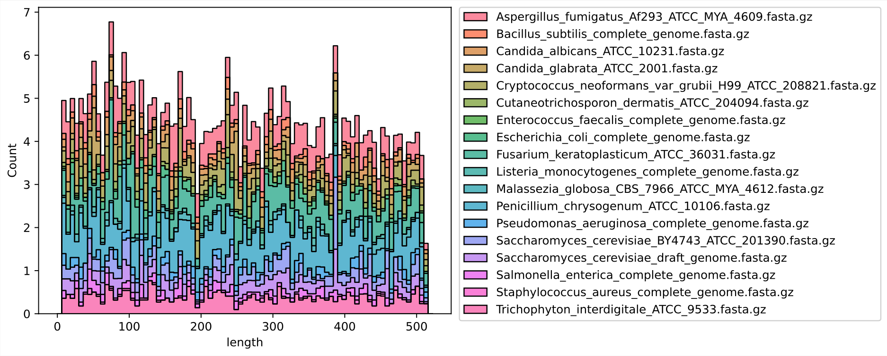
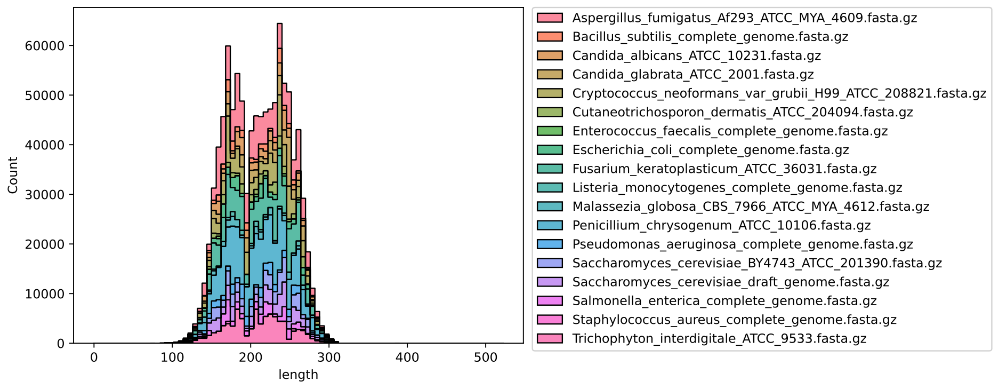
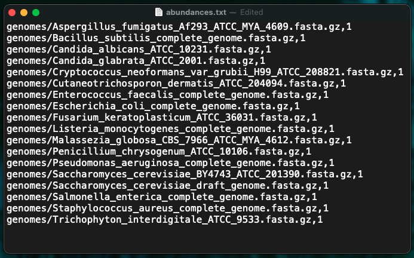

# readsynth

## what is readsynth?
Readsynth is a series of python scripts that simulate reduced-representation sequencing libraries with special consideration to DNA fragment abundance. Readsynth takes as input any reference nucleotide sequences in fasta format (i.e. reference genome or genomes) along with custom restriction enzyme and adapter information to simulate the reads expected from an Illumina-based sequencing reaction.

Readsynth is aimed at standardizing reduced-metagenome sequencing (RMS) libraries, where diverse community members are expected to yield differences in abundance due to molecular sequencing preparation.





## what makes readsynth different?
The preparation of DNA sequencing libraries include many variables which influence the frequency of a given read, including restriction enzyme site frequency in the sample genome(s), enzyme digestion efficiency, size-selection, as well as PCR bias based on DNA fragment length. Readsynth allows users to control common sources of variability introduced in typical enzymatic library preparations (e.g. RADseq, ddRADseq, GBS, etc.).

## requirements
To begin using readsynth for the first time, change to the src directory and run:
```
make apply_error
```

Python packages numpy, pandas, and seaborn
To install using pip:
```
python3 -m pip install numpy
python3 -m pip install pandas
python3 -m pip install seaborn
```

To install using conda (in a conda environment):
```
conda install numpy
conda install pandas
conda install seaborn
```

## usage

**inputs**
- table of locally stored genome assembly files (fasta) and abundance
- desired total number of reads
- restriction enzyme motifs and cut efficiency (can use iso-length REs or 16S/ITS primers)
- size distribution parameters (or locally stored json of custom distribution)
- optional: custom adapter sequences
- optional: pre-existing fastq data to train error profile
- see full list of custom settings under 'input options' below



**outputs**
- csv of **all possible fragments** within a specified maximum length (base pairs)
- csv of **expected fragment counts** given a specified restriction enzyme digestion efficiency
- csv of **size-selected fragment counts** within a specified Normal distribution of read lengths
- optional: simulated fastq file of expected reads


## example ddRADseq library creation
```
readsynth.py -g abundances.csv -m1 EcoRI -m2 T/TAA -n 1_000_000 -c 0.90 -u 300 -sd 100 -l 150 -o /output_directory
```
The above example takes 'abundances.csv' as a genome abundance file **g** with all reference fasta files to be digested with EcoRI (**m1**) and MseI (**m2**) in a strand-specific fashion (e.g. the forward adapter always ligates with the /AATTC overhang from EcoRI). Assuming a desired output of 1 million reads (**n**) in total, digest simulation will calculate the expected number of DNA fragments given the enzyme digestion cut efficiency (**c**) occurs at a probability of 90% at any random RE motif. The resulting fragments will be size-selected using a normal distribution defined by **u** and **sd**. Paired-end Illumina reads of length (**l**) 150bp will be written to a simulated fastq file (default output has perfect scores).

## example 16S library creation
```
readsynth.py -g abundances.csv   -m1 /CCTACGGGNGGCWGCAG /CTGCWGCCNCCCGTAGG -m2 /GACTACHVGGGTATCTAANCC /GGNTTAGATACCCBDGTAGTC -n 1_000_000 -free -l 150 -o /output_directory
```
The above example differs from the ddRADseq library creation in that in place of a single, palindromic restriction motif for -m1, we now provide the forward V3-V4 primer along with its reverse complement. Further, this library avoids applying a gaussian size selection step and utilizes the **free** argument to go distribution-free.

## example isolength library creation
```
readsynth.py -g abundances.csv -iso BcgI -n 1_000_000 -l 150 -o /output_directory
```
The above example uses a single, isolength (type IIB) restriction enzyme to produce fragments, and by its nature, requires no size distribution.

## input options
```
  -h, --help       show this help message and exit
  -g G             path to file genome
  -o O             path to store output
  -m1 M1 [M1 ...]  space separated list of RE motifs (e.g., AluI or AG/CT, HindIII or A/AGCTT, SmlI or C/TYRAG)
  -m2 M2 [M2 ...]  space separated list of RE motifs (e.g., AluI or AG/CT, HindIII or A/AGCTT, SmlI or C/TYRAG)
  -iso ISO         optional type IIB RE motif (e.g., NN/NNNNNNNNNNCGANNNNNNTGCNNNNNNNNNNNN/)
  -l L             desired read length of final simulated reads
  -test            test mode: create newline-separated file of RE digested sequences only
  -n N             total read number
  -u U             mean (in bp) of read lengths after size selection
  -sd SD           standard deviation (in bp) of read lengths after size selection
  -x X             fragment length where fragment distribution intersects size distribution
  -d D             json dictionary of fragment length:count for all expected bp fragments range
  -free            distribution-free mode: bypass size selection process
  -c C             percent probability of per-site cut; use '1' for complete digestion of fragments (fragments will not contain internal RE sites)
  -a1 A1           file containing tab/space-separated adapters and barcode that attach 5' to read
  -a2 A2           file containing tab/space-separated adapters and barcode that attach 3' to read
  -a1s A1S         manually provide bp length of adapter a1 before SBS begins
  -a2s A2S         manually provide bp length of adapter a1 before SBS begins
  -q1 Q1           file containing newline-separated R1 Q scores >= length -l
  -q2 Q2           file containing newline-separated R2 Q scores >= length -l
```

# software overview

```
--readsynth.py
|| |
|| |`_ 1a. digest_genomes.py -  store seq and pos of possible RE fragments
|| `__ 1b. prob_n_copies.py  -  partially digest genome with n copies
| `___ 2.  size_selection.py  -  size select reads from defined distribution
 `____ 3.  write_reads.py     -  write fragments as paired end fastq-formatted reads
```

## 1. digest_genomes.py  
Given a fastq sequence, digest_genomes.py performs a regex search for all m1/m2 restriction motifs. Once a motif hit occurs, the sequence is searched forward within a set range (**max**, default is mean + 6sd). The start and end position as well as the orientation of the motifs is saved, and sequences are reverse-complemented when oriented on the reverse direction of the reference sequence. Only fragments that contain the m1 motif(s) at the 5' end and the m2 motif(s) at the 3' end will be kept.

Below is a toy genome example of a search for m1=G/AATTC and m2=T/TAA where the maximum fragment length to search forward is 50bp:
```
     _______maximum expected fragment length__________
    |                                                 |

    4                                37         48                     71
    m1                               m2         m2                     m1
    v                                v          v                      v
GTGAGAATTCGTTGAAAATCCGGTCCTGACGGGACTTTTAACAAGGAATTAAAGATCGCCATAATATTATTGAATTCCC
CACTCTTAAGCAACTTTTAGGCCAGGACTGCCCTGAAAATTGTTCCTTAATTTCTAGCGGTATTATAATAACTTAAGGG

possible fragments:

     AATTCGTTGAAAATCCGGTCCTGACGGGACTTT
         GCAACTTTTAGGCCAGGACTGCCCTGAAAAT

     AATTCGTTGAAAATCCGGTCCTGACGGGACTTTTAACAAGGAAT
         GCAACTTTTAGGCCAGGACTGCCCTGAAAATTGTTCCTTAAT

                                      TAACAAGGAAT      m2 -> m2 orientation, fragment not kept
                                        TGTTCCTTAAT

                                      TAACAAGGAATTAAAGATCGCCATAATATTATTG
                                        TGTTCCTTAATTTCTAGCGGTATTATAATAACTTAA

                                                 TAAAGATCGCCATAATATTATTG
                                                   TTCTAGCGGTATTATAATAACTTAA
```
The resulting fragments are saved in the output directory as a csv-formatted 'raw_digest' file.

## 2. prob_n_copies.py
Once the raw digest fragments have been determined, prob_n_copies.py uses the per-site probability of enzyme cleaving (**c**) to simulate digesting **n** copy numbers of the input genome. This model captures the non-uniform distribution of fragments where fragments containing intervening cut sites will be less abundant.

## 3. size_selection.py
Now that we have a baseline number of fragments expected from n number of genome copies with a given digestion efficiency, we use the **mean** and **sd** arguments to draw fragments from a Normal distribution. The area under the distribution (number of reads) is grown until reads in the range of mean through mean + 2sd are not under-represented in the sampling process.

## fastq output formatting
In each sequence header, the following components may be useful for a number of analyses:

```
@62:47:138:34:CGAAGGTGAT:TGCCAAT:full_genome.fna 1
```

|@|62|47|138|34|CGAAGGTGAT|TGCCAAT|full_genome.fna|1|
|:-|:-|:-|:-|:-|:---------|:------|:-------------|:-|
|'@'|fastq index|index of counts file|length of fragment with adapters|length of fragment|p5 adapter id|p7 adapter id|fasta name|r1/r2 read|

